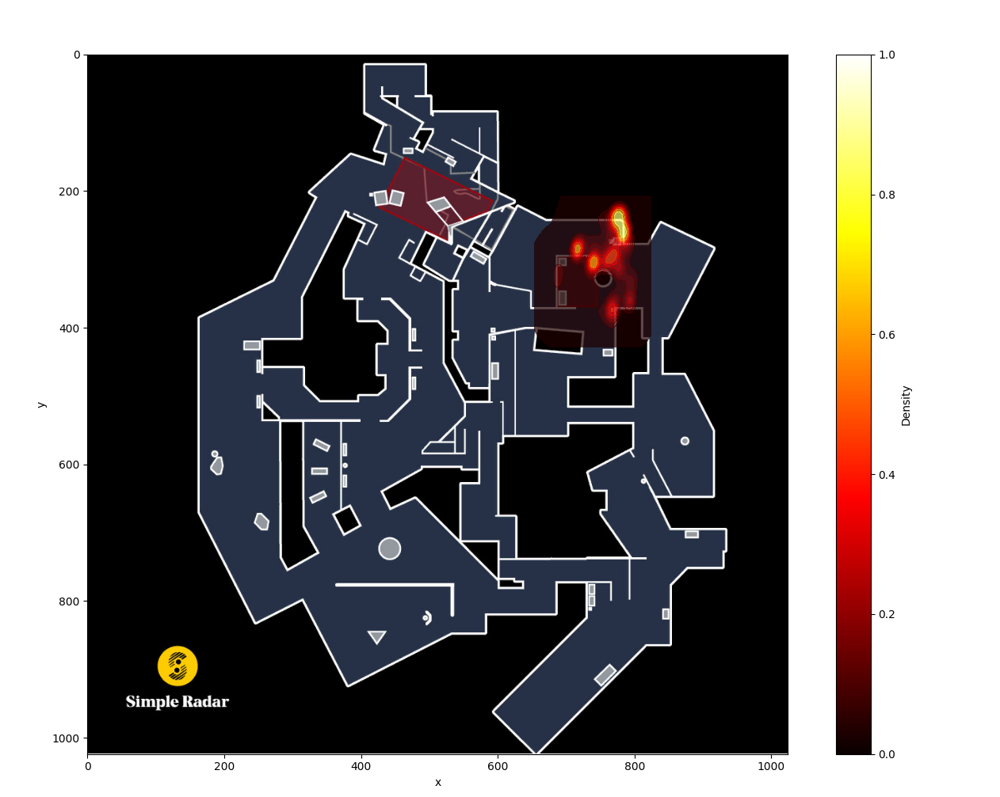
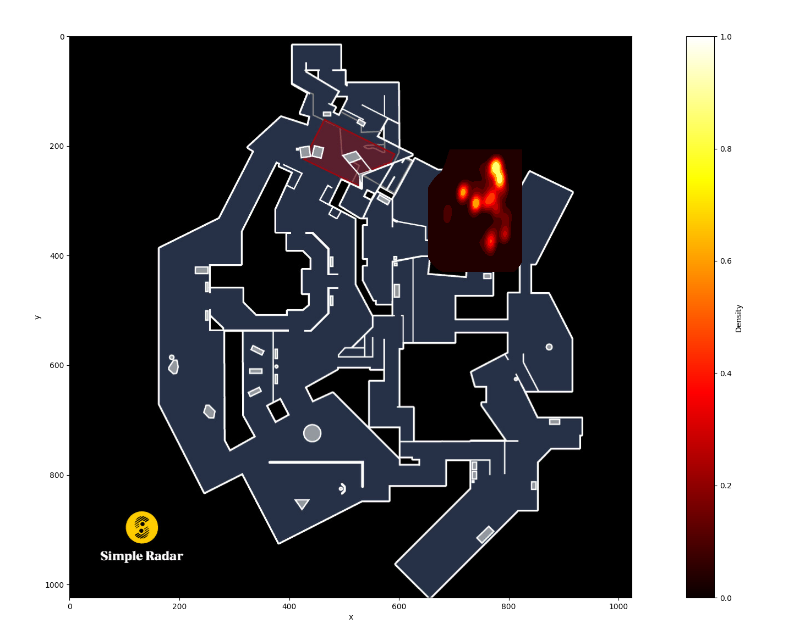
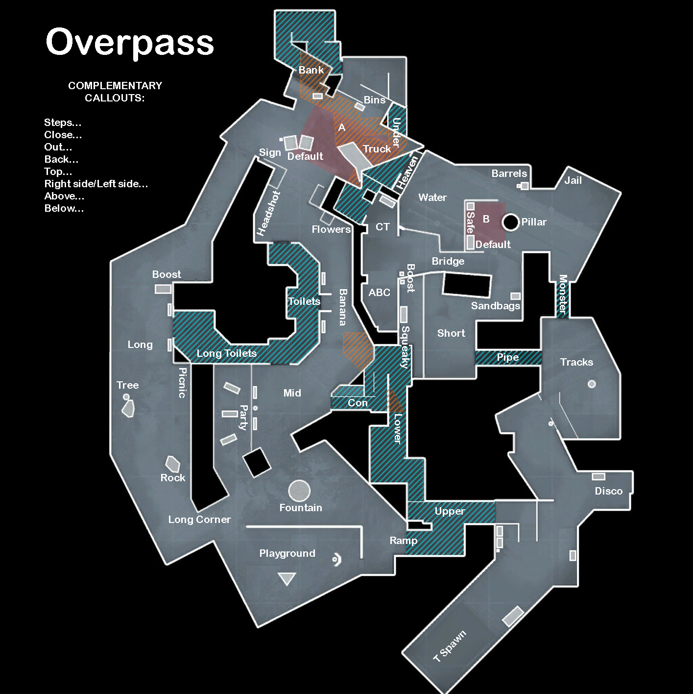

# CSGO Replay Analyzer v1.0

Replay Analyzer for the game Counter-Strike: Global Offensive. Replay file must first be extracted as a parquet file to be analyzed.

## Install/Run:

To run the program, please first run

```
pip install -r requirements.txt
```

Then, run main.py with

```
python src/main.py
```

## Sample Usage:

1. Based on data from sample: "[label](data/game_state_frame_data.parquet)"

- a. Entering via the light blue boundary does not seem to be a common strategy used by Team2 on T side, as they only enter the light blue boundary 6.67% of their rounds. In fact, only in round_num 16 does Team2 on T side even enter the boundary.
- b. Team2 on T side enters "BombsiteB" with at least 2 rifles or SMGs, on average, 30.36 seconds into the round. This is calculated by the average of round_num 21, 28, and 30, where they enter at the time of 20.0, 32.4, and 38.67 seconds respectively.
- c. Based on the following heatmap and Overpass map callouts, Team2 on CT side will most likely be waiting at "barrels" (very likely), behind "pillar" (quite likely), right behind site (quite likely), and around the wall between "short" and "monster" (occasionally). In terms of heatmap densities, very likely is ~80%, quite likely is ~50-60%, and occasionally is ~20-30%, as shown in the Full Alpha Heatmap image. The densities are calculated via a kernel density estimate (KDE).

    #### Heatmap:
    
    #### Full Alpha Heatmap:
    
    #### Callouts:
    

## Frontend Proposal
3. For future work on a frontend interface, a simple web application with HTML rendering and Flask is provided:

#### User Interface:

First, users would be able to upload their own Parquet data, radar image, boundary coordinates, and weapon(s) / weapon count(s) onto a simple, HTML-rendered user interface. Please see wireframe below for visualization.

**Main Page:** The user interface would first have a main page that links to Upload Parquet, Upload Radar Image, and Processing.

**Upload Parquet and Upload Radar Image Pages:** These pages allow the user to upload their respective files and provide names, which would be sent as a POST request to the server and stored as a server data file. 

**Processing Page:** This page would allow the user to select their Parquet file and Radar Image file from their respective server data folders from dropdown menus. The Radar Image would then be loaded on the page, along with a user interface that allows the user to input the required boundaries. The user can then select the boundary area(s) from a dropdown list. These areas can be generated based on the parquet file data.  Furthermore, a boundary area could be drawn in real time on the radar as the boundary coordinates are inputted. Finally, the user can select the desired weapon(s) or weapon classes from a dropdown menu, as well as weapon count(s). Once the user is done, they can click the "Process" button, which will send another POST request with the boundary coordinates and weapon specifications to the server.

#### User Interface Wireframe:


#### Server Side:

The data is then handled by Flask to be processed server-side. Flask will take the provided inputs and files, run the application, and then return the results to the users' web client as a plain text HTTP response with the console outputs of the application saved in a .txt file.

For security and to prevent unauthorized access to our application, we could implement a simple user authentication prior to making the user interface accessible using Flask-Login or similar.

#### Some Side Notes:

Using a Javascript library such as React or Vue.js could help to make a more fleshed-out frontend, but shouldn't be necessary for the task at hand. An executable desktop application could also work, but may result in security issues and accessibilty problems for coaches on the move. Finally, a serverless computing service, such as AWS Lambda, could also be used for server-side processing if the application were to ever be scaled for a wider audience.


## Python Libraries:

The following external libraries were used in this assignment. These are required to be installed prior to running main.py.

+ pandas
+ matplotlib
+ numpy
+ seaborn
+ pyarrow


## Credits:
Overpass Callouts Image: https://teams.gg/blog/csgo-overpass-callouts/